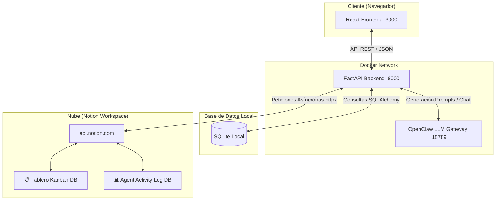

# 🚀 FlowStep AI — Sistema Multi-Agente & Notion Kanban

FlowStep AI es un asistente personal de productividad y organización inteligente basado en una **arquitectura multi-agente cooperativa** y sincronizado en tiempo real con un **tablero Kanban visual en Notion**. 

El sistema permite escribir tus pendientes del día en lenguaje natural, y delega a un equipo de agentes inteligentes la tarea de categorizar, balancear la carga cognitiva y estructurar planes de resolución detallados que puedes gestionar visualmente desde el frontend del proyecto o directamente desde tu espacio de trabajo en Notion.

---

## 🎨 Características Principales

*   **Triage Inteligente & Balanceo Cognitivo:** Analiza tus tareas del día y limita la sobrecarga de trabajo degradando la urgencia de tareas complejas cuando superan tu capacidad máxima recomendada.
*   **Sincronización Bidireccional con Notion:** Lee y escribe las tareas en tiempo real desde Notion utilizando su API REST oficial.
*   **Tablero Kanban Interactivo (React):** Un tablero premium con efectos visuales de cristal (glassmorphism) y animaciones fluidas organizadas en 5 columnas (*Backlog, To Do, In Progress, En Revisión, Done*).
*   **Sistema Multi-Agente Cooperativo:**
    *   **🧠 Agente Organizador:** Triagea tareas, deduce prioridades, esfuerzos, categorías y las publica de forma organizada en el Kanban de Notion.
    *   **⚡ Agente Ejecutor:** Propone guías detalladas de resolución paso a paso para la tarea seleccionada y automatiza la actualización de estados.
*   **Resiliencia Total (localStorage):** Persistencia total del estado en el navegador para que recargar la página nunca te haga perder el hilo de tu sesión.
*   **Modo Híbrido (Real / Mock):** Funciona al 100% de manera autónoma simulando la IA y Notion si no dispones de API keys, y pasa a modo real con solo configurar las credenciales en el archivo `.env`.

---

## 📂 Estructura del Proyecto

El proyecto está estructurado como una aplicación multi-contenedor de Docker:

```
flowstep-ai/
├── backend/                  # API REST construida con FastAPI
│   ├── agent/                # Cliente de OpenClaw (LLM Gateway)
│   ├── agents/               # Clases de agentes (Base, Organizador, Ejecutor, Manager)
│   ├── models/               # Declaración de bases de datos SQLite (SQLAlchemy)
│   ├── notion/               # Módulo cliente, esquemas y scripts de setup para Notion
│   └── routers/              # Enrutadores API (auth, tasks, notion_routes)
├── frontend/                 # Interfaz de usuario construida con React & Vite
│   ├── src/
│   │   ├── components/       # Componentes gráficos reutilizables
│   │   ├── pages/            # Vistas (Landing, Triage, RoadMap, Kanban, AgentPanel)
│   │   ├── App.jsx           # Enrutamiento y persistencia en localStorage
│   │   └── index.css         # Diseño visual, orbes y estilos Kanban
├── openclaw/                 # Gateway de Modelos de Lenguaje (LLM)
├── docs/                     # Guías y documentación del proyecto
│   └── NOTION_SETUP.md       # Guía paso a paso para configurar tu Integration de Notion
├── docker-compose.yml        # Orquestación de contenedores Docker
└── .env.example              # Plantilla para variables de entorno
```

---

## 🏗️ Arquitectura del Sistema



### Flujo de Datos
1.  El usuario ingresa tareas en el frontend.
2.  El backend las pasa al **Agente Organizador** a través del `AgentManager`.
3.  El Organizador solicita el análisis al LLM (vía **OpenClaw**) y mapea los resultados.
4.  El Organizador crea las páginas correspondientes en la Base de Datos de Notion.
5.  Los cambios se guardan localmente en **SQLite** para mantener coherencia.
6.  El frontend consulta directamente a Notion para pintar las tarjetas en el **Tablero Kanban**.
7.  El usuario presiona **Ejecutar (⚡)** en el Kanban. El **Agente Ejecutor** se activa, genera el plan detallado con la IA, añade las notas en Notion y actualiza el estado a "In Progress".

---

## 🛠️ Guía de Montaje y Despliegue Local

Sigue estos pasos para compilar, configurar y levantar el proyecto en tu máquina local.

### Prerrequisitos
Asegúrate de tener instalados en tu sistema:
*   [Docker Desktop](https://www.docker.com/products/docker-desktop/)
*   [Node.js](https://nodejs.org/) (opcional, para desarrollo local fuera de Docker)
*   [Python 3.12](https://www.python.org/) (opcional, para desarrollo local fuera de Docker)

---

### Paso 1: Configurar las Variables de Entorno (`.env`)
Duplica el archivo `.env.example` en la raíz del proyecto y renómbralo a `.env`:

```bash
copy .env.example .env
```

Abre el archivo `.env` y configura los valores requeridos:

*   **JWT_SECRET:** Una frase secreta segura para firmar tokens JWT (ej. `mi-clave-secreta-super-segura`).
*   **ANTHROPIC_API_KEY:** Tu API Key de Claude/Anthropic (empieza con `sk-ant-...`). *Si no tienes una o la dejas en blanco, el backend activará automáticamente el modo simulado inteligente.*
*   **NOTION_API_TOKEN:** Tu token de integración interna de Notion (empieza con `secret_...`). *Si lo dejas en blanco, se activará el modo mock de Notion.*
*   **NOTION_ROOT_PAGE_ID:** El ID de la página padre en Notion bajo la cual se crearán las bases de datos del Kanban.

*(Puedes consultar más detalles para obtener estas claves en la guía completa: [NOTION_SETUP.md](file:///c:/Users/Usuario/FlowStep%20AI/flowstep-ai/docs/NOTION_SETUP.md))*

---

### Paso 2: Crear las Bases de Datos en Notion (Automático)
Si vas a utilizar Notion de verdad (con credenciales reales), una vez configurado tu `.env`, puedes crear las bases de datos necesarias de forma automática.

Ejecuta el script de instalación provisto en el backend:

```bash
# 1. Crear entorno virtual (opcional pero recomendado)
python -m venv venv
venv\Scripts\activate

# 2. Instalar dependencias
pip install -r backend/requirements.txt

# 3. Correr el inicializador
python backend/notion/setup_databases.py
```

El script creará automáticamente dos bases de datos en tu página de Notion:
1.  **📋 FlowStep Tasks** (con propiedades Name, Status, Priority, Effort, Type, Agent, Session ID, Order, Notes).
2.  **📊 Agent Activity Log** (con propiedades Action, Agent, Status, Details, Timestamp y una relación directa a la base de datos de tareas).

Al finalizar, el script imprimirá los IDs de estas bases de datos en la terminal. Cópialos y agrégalos a tu archivo `.env`:
```env
NOTION_TASKS_DB_ID=tu_id_de_tasks_database_aqui
NOTION_LOG_DB_ID=tu_id_de_logs_database_aqui
```

---

### Paso 3: Construir y Levantar con Docker Compose
Con el archivo `.env` configurado, levanta la aplicación completa ejecutando el siguiente comando en la raíz del proyecto:

```bash
docker compose up --build -d
```

Este comando descargará las imágenes base, instalará dependencias, compilará la versión estática del frontend en React mediante Vite y encenderá los tres servicios en segundo plano:

*   **Frontend Web:** Disponible en [http://localhost:3000](http://localhost:3000)
*   **Backend FastAPI:** Disponible en [http://localhost:8000](http://localhost:8000)
*   **OpenClaw Gateway:** Disponible en el puerto `:18789`

Para ver los logs en vivo de los servicios y agentes, ejecuta:
```bash
docker compose logs -f
```

---

## 🤖 El Sistema de Agentes

Una vez inicias sesión en el Frontend de FlowStep:

1.  **Ingesta de Pendientes:** Escribe tu lista de cosas por hacer (una por línea) en la pantalla de **Triage**.
2.  **Propuesta de Ruta:** El **Agente Organizador** se despertará (`state = working` en el Panel de Agentes), catalogará tus tareas y balanceará la carga cognitiva si detecta exceso de tareas urgentes/complejas. 
3.  **Aceptación del Plan:** Al presionar "Comenzar con este Plan", las tareas se instanciarán directamente como tarjetas físicas en tu espacio de Notion y se abrirá el **Tablero Kanban**.
4.  **Ejecución Autónoma:** 
    *   Al hacer clic en el botón de **Ejecutar (⚡)** de cualquier tarjeta, el **Agente Ejecutor** tomará el control.
    *   Moverá la tarea a la columna *In Progress*.
    *   Generará un plan detallado de resolución para esa tarea en particular mediante el LLM y lo inyectará directamente en la descripción/notas de la tarjeta en Notion.
5.  **Cierre y Revisión:** Una vez resuelvas el plan propuesto, puedes enviar a revisión (columna *En Revisión*) o marcar como completado (columna *Done*), lo cual actualizará el log de auditoría en Notion con éxito.

---

## ⚙️ Desarrollo Fuera de Docker (Opcional)

Si deseas realizar modificaciones y correr los servicios localmente sin contenedores:

### Iniciar Backend
```bash
cd backend
pip install -r requirements.txt
python -m uvicorn main:app --reload --port 8000
```

### Iniciar Frontend
```bash
cd frontend
npm install
npm run dev
```
*(El servidor de desarrollo correrá en [http://localhost:3000](http://localhost:3000))*

---

## 📄 Licencia
Este proyecto es software privado de desarrollo interno para la Fase Alpha Sprint 2 (Pivot Notion Multi-Agent). Todo el código está configurado bajo la arquitectura de microservicios e infraestructura de FlowStep AI.
